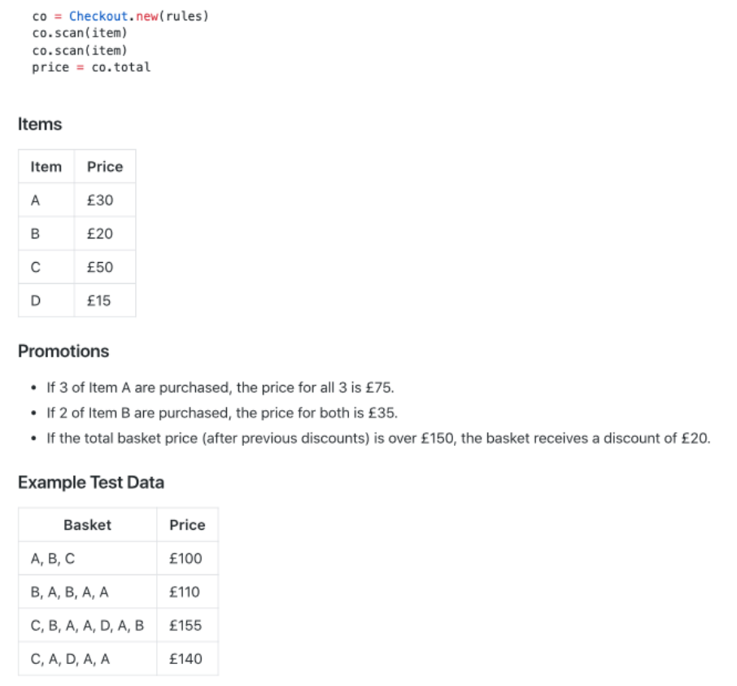

<h3>The task is to implement a checkout system that conforms to the following interface:</h3>
<h4>Ruby 2.6.5</h4>
<h4>Install:</h5>
<ul>
<li>bundle install</li>
</ul>

<h4>run test:</h5>
<ul>
<li>rspec spec/checkout_spec.rb</li>
</ul>

